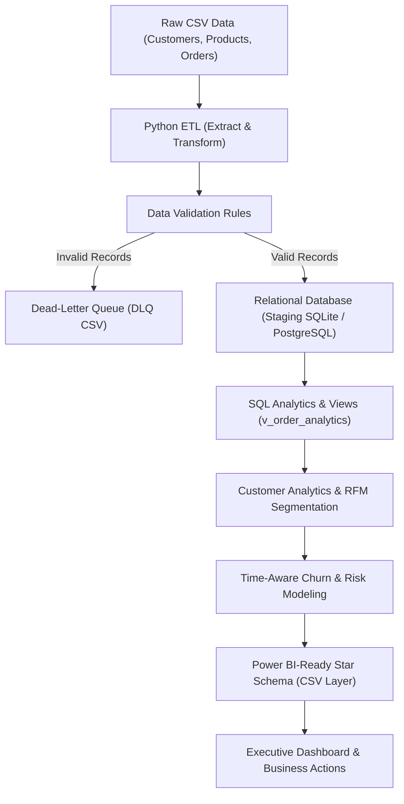

# Platform Architecture

This document describes how data moves through the platform, from raw CSV files to analytical tables and dashboards.

---

## Architecture Flow

---

## Pipeline Stages

### 1. Raw Data Ingestion
The raw layer contains source CSV extracts for customers (10,080 records), products (500 records), and transactional orders (106,919 records). These files represent untamed data directly from transactional databases, containing dirty text, missing values, duplicates, and reference errors.

### 2. Python ETL (Extract & Transform)
The extraction and transformation scripts (`src/etl/extract.py`, `src/etl/transform.py`) normalize name formatting and title casing, standardize payment method abbreviations (such as mapping "CC" to "Credit Card"), and impute missing customer ages using the median age (39.0) with an audit tracking flag.

### 3. Data Validation
The validation engine (`src/etl/validate.py`) checks primary key uniqueness, demographic age bounds (18 to 100), product category and cost completeness, positive price/cost domain rules, and referential integrity between orders, customers, and products.

### 4. Dead-Letter Queue (DLQ) vs. Clean Data
Non-conforming records are never silently dropped; they are routed to `data/processed/rejected_records.csv` with a specific rejection reason, UTC timestamp, and the raw payload stored as JSON. Valid records (114,187 out of 117,499) proceed to clean CSV storage and database loading.

### 5. Relational Database Staging
Valid records are loaded into a relational staging data warehouse (`data/processed/staging.db`). The production DDL script (`sql/schema.sql`) and loader (`src/etl/load.py`) also support direct deployment to PostgreSQL with primary keys, foreign keys, and indexes.

### 6. SQL Analytics & Views
The analytical view `v_order_analytics` pre-joins orders, customers, and products at order-line granularity. It calculates invoiced revenue, net revenue, cost of goods sold, profit, and flags fulfilled transactions (`Completed` or `Shipped`) versus friction transactions (`Refunded` or `Cancelled`).

### 7. Customer Analytics & RFM Segmentation
Customer-level features are aggregated and scored using RFM (Recency, Frequency, Monetary) quintiles into 9 distinct behavioral segments. Registered accounts with zero completed orders are cleanly handled as "Inactive / Unactivated" without division errors.

### 8. Churn & Risk Modeling
The modeling engine calculates cutoff-safe features to predict customer churn over a rolling 90-day forward window. It trains a primary Logistic Regression model (ROC-AUC 0.9481) and a comparator Random Forest model (ROC-AUC 0.9510), ensuring no post-cutoff data leaks into features or preprocessors.

### 9. Power BI-Ready Data Layer
A clean dimensional star schema is exported under `data/processed/powerbi/`, comprising `dim_date.csv`, `dim_customers.csv`, `dim_products.csv`, `fact_orders.csv`, and `dim_customer_analytics.csv`. All foreign keys resolve cleanly with zero orphan records.

### 10. Dashboard & Business Decisions
The data feeds 24 reusable DAX measures, Power Query M import scripts, and an interactive HTML visual prototype (`dashboard/index.html`). The resulting metrics provide leadership with clear visibility into customer concentration, margin leakage, and retention priorities.
